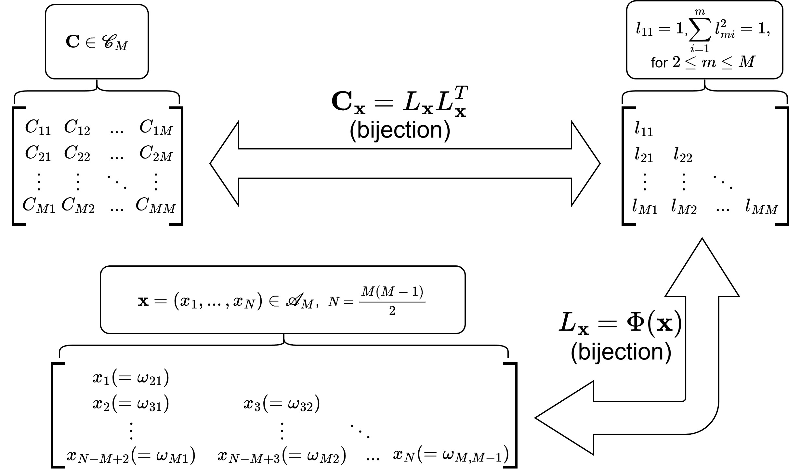
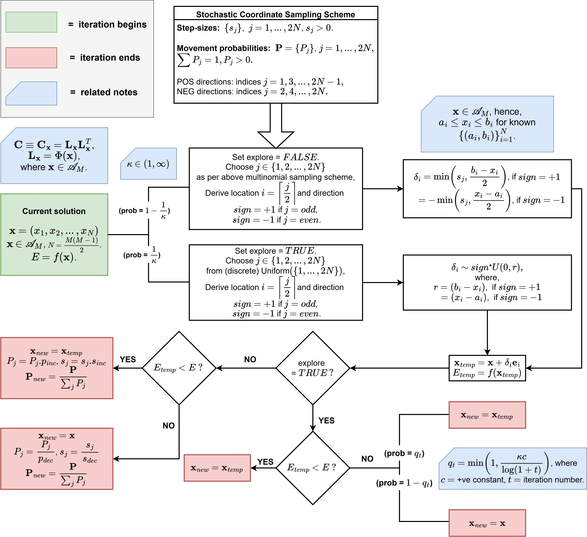

# GLASD: Global Adaptive Stochastic Descent for Robust Correlation Estimation

This repository provides an implementation of **GLASD (Global Adaptive Stochastic Descent)**, a loss-agnostic, black-box optimization framework for **robust estimation of high-dimensional correlation matrices** under general Mahalanobis-type loss functions. The methods and experiments in this repository correspond to the manuscript:

> **Robust Correlation Estimation under General Loss Functions**  
> Priyam Das, Department of Biostatistics, Virginia Commonwealth University

GLASD is designed to reliably optimize **non-convex, non-smooth, and even discontinuous objectives** over the space of positive definite correlation matrices, without requiring gradient information or smoothness assumptions.

---

## 🔑 Key Features

- **Loss-agnostic framework**  
  Supports Gaussian, Huber, truncated quadratic, Tukey’s biweight, and other user-defined Mahalanobis losses.

- **Geometry-aware optimization**  
  Uses a bijective hyperspherical (angular) parameterization of the correlation matrix space to enforce constraints by construction.

- **Derivative-free global optimization**  
  Combines adaptive stochastic coordinate descent with controlled forced exploration, enabling reliable global search.

- **Theoretical guarantees**  
  Includes global convergence guarantees and statistical consistency results under mild regularity conditions.

- **Practical applicability**  
  Demonstrated through extensive simulations and real-data applications, including cancer proteomic and microbiome datasets.

---

### Notation note

Throughout the code, comments, and documentation, the symbols **`M`** and **`p`** may occasionally be used interchangeably.  
Both symbols refer to the **same quantity**: the **dimension (number of rows/columns) of the correlation matrix of interest**.

---

## 📂 Repository Structure

```text

GLASD/
├── Benchmark GLASD Box/                      # Empirical convergence benchmarks for GLASD and competing optimizers on box-constrained test functions (Ackley, Griewank, Rastrigin, Rosenbrock)
├── Benchmark/                                # Benchmark comparison studies for robust correlation estimation methods reported in the manuscript
├── Case study high dim/                      # High-dimensional real-data case study with CRC microbiome analyses
├── Case study/                               # Real-data case study with cancer proteomics data
├── Simulation study factor based scenario/   # Simulation studies under approximate factor model settings 
├── Simulation study non-factor scenario/     # Simulation studies without factor structure 
├── images/                                   # Figures used in the manuscript and supplementary material
├── README.md                                 # Project overview and usage instructions

```

## 📌 Problem Setting

GLASD is developed to address **robust estimation of correlation matrices** in high-dimensional settings where observations may exhibit outliers, heavy tails, or other departures from Gaussian assumptions. In such regimes, the sample correlation matrix is both statistically unstable and highly sensitive to extreme observations, motivating the use of alternative loss functions that control the influence of large Mahalanobis distances.

Rather than committing to a single likelihood or contamination model, GLASD formulates correlation estimation as a **general loss-based optimization problem** over the constrained space of positive definite correlation matrices with unit diagonal. Specifically, the target estimator is defined as the solution to

<pre>
minimize    f(C)
subject to  C ∈ 𝒞<sub>M</sub>
</pre>

where  
- \( 𝒞<sub>M</sub> \) denotes the space of full-rank \( M x M \) correlation matrices, and  
- \( f(C) \) is a user-specified Mahalanobis-type objective function.

This formulation accommodates a wide class of loss functions, including Gaussian likelihoods, Huber-type losses, truncated quadratic losses, and redescending M-estimators (e.g., Tukey’s biweight). Importantly, the resulting optimization problem is typically **non-convex, non-smooth, and sometimes discontinuous**, and is defined over a geometrically constrained parameter space.

GLASD is designed to solve this problem directly—without requiring gradient information, smoothness assumptions, or problem-specific algorithmic tailoring—by combining a geometry-aware reparameterization of the correlation matrix space with a derivative-free global optimization strategy.

---

## 🧠 Method Overview

GLASD operates by reparameterizing the space of correlation matrices using a **bijective hyperspherical (angular) mapping**, which transforms the constrained matrix optimization problem into a **box-constrained optimization problem in Euclidean space**. This mapping guarantees feasibility by construction: every point in the angular domain corresponds to a valid correlation matrix.

Once reformulated, optimization is performed using **Global Adaptive Stochastic Descent**, a derivative-free algorithm that combines adaptive coordinate-wise descent with controlled stochastic exploration. The method requires only objective evaluations and does not rely on gradients, smoothness, or continuity assumptions.

The overall geometry-aware optimization pipeline is illustrated in the following figures:

**Correlation matrix geometry and angular mapping** 
<p align="center">
  
</p


**GLASD algorithmic flowchart**
<p align="center">
  
</p

Together, these figures summarize how GLASD enforces correlation constraints, adapts step sizes and directional probabilities, and balances exploitation with global exploration.

---

## 📐 Theoretical Guarantees

GLASD is supported by rigorous theoretical results that address both optimization and statistical estimation:

- **Global convergence of GLASD**  
  Under mild regularity conditions on the objective function—specifically boundedness and measurability over a compact domain—GLASD is guaranteed to converge globally to a minimum of the target objective. These guarantees do not rely on convexity, differentiability, or smoothness, and remain valid for non-smooth or discontinuous loss functions through the algorithm’s controlled stochastic exploration mechanism.

- **Statistical consistency of GLASD-based estimators**  
  When GLASD is used to optimize loss-based Mahalanobis objectives for correlation estimation, the resulting estimators are shown to be statistically consistent under a uniform law of large numbers. In particular, the GLASD-based estimator converges to the population-level minimizer of the corresponding loss function, even when the objective is non-convex or non-smooth.

Together, these results justify the use of GLASD as a principled optimization framework for robust correlation estimation under general loss functions that fall outside the scope of classical likelihood-based or gradient-driven methods.

---

## 📊 Benchmark Experiments

To assess optimization performance on structured constrained domains, GLASD is benchmarked against classical local and global optimization methods using four standard non-convex test functions:

- Ackley  
- Griewank  
- Rastrigin  
- Rosenbrock  

These functions are embedded into the correlation matrix space by evaluating them on the off-diagonal entries of valid correlation matrices. Summary comparisons and variability across dimensions are reported in the manuscript and supplementary material.

Representative benchmark visualizations are provided as boxplots below, summarizing optimization performance.

<p align="center">
  
</p
  
---

## 🧪 Simulation Studies

GLASD is evaluated through two complementary simulation regimes designed to reflect common challenges in high-dimensional correlation estimation. All simulation designs, parameter choices, and evaluation metrics correspond to those reported in the manuscript and supplementary material.

- **Non-factor-based scenarios**  
  Data are generated directly from dense correlation models without latent factor structure, under multiple contamination mechanisms and distributional regimes. Correlation matrices include both structured sparse designs (e.g., block Toeplitz) and fully non-sparse designs. Observations are sampled from asymmetric Gaussian contamination models (row-wise, column-wise, and random elementwise contamination) as well as heavy-tailed multivariate \(t\)-distributions. Simulations are conducted across multiple dimensional settings, including \((p,n) = (20,100), (50,500), (100,500)\). GLASD-based estimators (with Huber-type loss) are compared against the Gaussian sample estimator and Tyler’s M-estimator in terms of estimation accuracy and stability.

- **Factor-based scenarios**  
  Data are generated from approximate factor models with a low-rank common component and a structured idiosyncratic covariance matrix. The idiosyncratic component is considered under both diagonal and dense random regimes, and dimensions \(p = 50\) and \(p = 100\) are examined. GLASD is compared against classical POET, robust POET with known factors, robust POET with unknown factors, and naive estimators that ignore factor structure. This setting evaluates GLASD’s performance when latent structure is present but not explicitly modeled in the loss-based formulation.

Across both regimes, the simulation results demonstrate that GLASD yields stable and competitive correlation estimates across a wide range of dimensions, contamination mechanisms, and structural assumptions, while avoiding the numerical instabilities and sensitivity to modeling assumptions observed in several competing methods.

---

## 🧬 Case Study: CRC Microbiome Correlation Analysis

GLASD is applied to a colorectal cancer (CRC) microbiome dataset to estimate robust correlation structures among microbial taxa. Using a Huber-loss-based objective, GLASD yields a **spectrally stable and interpretable correlation estimate**, in contrast to classical estimators that exhibit numerical instability under heavy-tailed behavior.

A representative heatmap from this analysis is available in the `images/` directory and is reported in the manuscript and supplementary material.

---

This repository is intended to serve both as a **research artifact accompanying the manuscript** and as a **general-purpose implementation** for robust, geometry-aware correlation matrix optimization.


